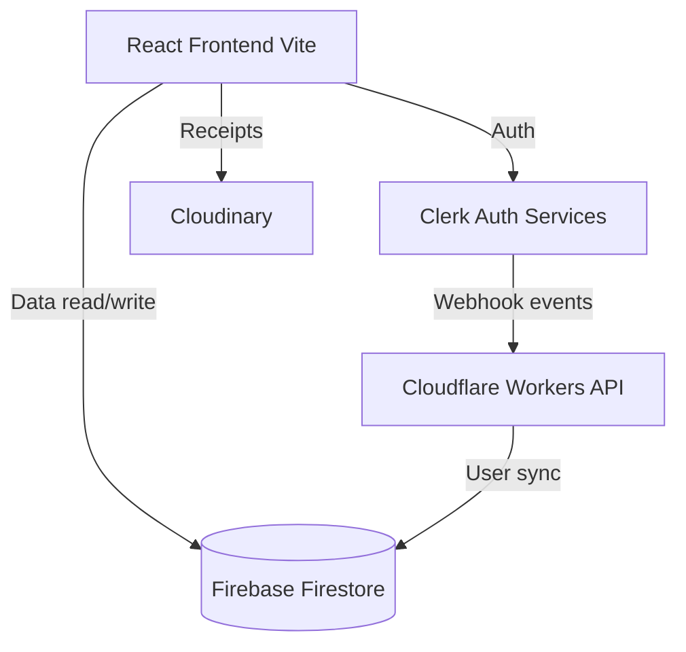

# Architecture

> Updated for Cloudflare Workers migration — 2026-09-13

## Overview
ExpenseFlow is a web-based expense tracking and group settlement application. It uses a React (Vite) frontend with a Firebase Firestore database. Authentication is managed by Clerk, which syncs users to Firestore via Cloudflare Worker webhook functions. The application uses Tailwind CSS for styling and Framer Motion for animations. It also relies on Playwright and Vitest for testing. Receipts are uploaded to Cloudinary.

## System Diagram

## Components

### Frontend UI Components
- **Purpose:** Provide user interfaces for expense logging, dashboard, landing, and settings.
- **Location:** `/client/src/components` and `/client/src/pages`
- **Dependencies:** React, TailwindCSS, Framer Motion, Recharts, Lucide React.

### Hooks & State Management
- **Purpose:** Reusable logic and state handling for auth, receipts, etc.
- **Location:** `/client/src/hooks`
- **Dependencies:** React Hooks, Custom logic.

### API / Client Layer
- **Purpose:** Abstract the communication between the UI and external services.
- **Location:** `/client/src/api`
- **Dependencies:** Firebase SDK.

### Cloudflare Worker API Functions
- **Purpose:** Handle secure event synchronization (like user creation/updates from Clerk to Firebase), JWT bridging for authentication, and group deletion.
- **Location:** `/worker.js` and `/api`
- **Endpoints:**
  - `POST /api/auth/jwt-bridge` — Clerk/Guest → Firebase custom token exchange
  - `POST /api/clerk-webhook` — Clerk user.created → Firestore user sync
  - `DELETE /api/delete-group` — Group and subcollection recursive deletion
  - `GET /api/health` — Deployment health check
- **Dependencies:** Standard Web Crypto (`crypto.subtle`), `svix`, `@clerk/backend`, Firestore REST API.

### Shared Utilities
- **Purpose:** Core business logic for balance calculations and fairness reports, strictly abstracted.
- **Location:** `/shared`
- **Dependencies:** None.

## Data Flow
1. User logs in/registers using Clerk components on the frontend.
2. Clerk sends a webhook securely to a Cloudflare Worker endpoint.
3. The Cloudflare Worker verifies the webhook signature via Svix and updates Firebase via the Firestore REST API.
4. User interacts with the frontend (e.g., adding an expense, uploading a receipt to Cloudinary).
5. The frontend communicates with Firebase Firestore directly using the Firebase Client SDK. Security is enforced by `firestore.rules`.
6. Data changes in Firestore are updated in the React app in real-time.

## Integration Points
| External Service | Type | Purpose |
|------------------|------|---------|
| Clerk | Auth API | User authentication and identity management |
| Firebase Firestore | Database | Primary database for expenses and users |
| Cloudflare Workers | Edge Serverless | Backend API for auth bridging and webhook handling |
| Cloudinary | Storage | Image hosting for uploaded expense receipts |

## Conventions
- **Naming:** CamelCase for utilities/hooks (`useAuth.jsx`), PascalCase for React components (`Dashboard.jsx`, `AppLayout.jsx`).
- **Structure:** Monorepo-like layout. Frontend in `/client`, serverless API in `/api`, shared logic in `/shared`, tests in `/tests`.
- **Testing:** Vitest for unit testing (`/tests/unit.test.js`), Playwright for E2E and visual tests, `@firebase/rules-unit-testing` for Firestore rules.

## Technical Debt
- Resolved: Permissive Firestore rules, committed secrets, and test mock branches were removed during the production-ready transformation.
- Addressed: Code duplication for categories, models, and logos has been extracted to shared utilities.
